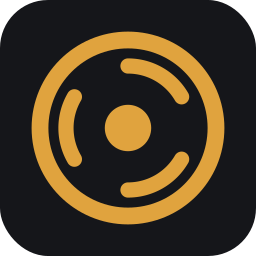
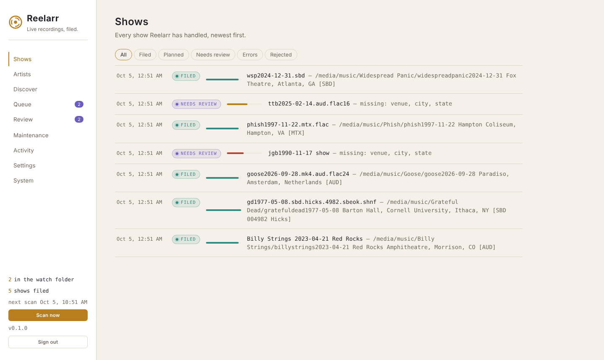
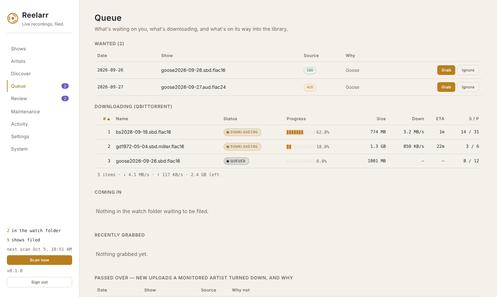
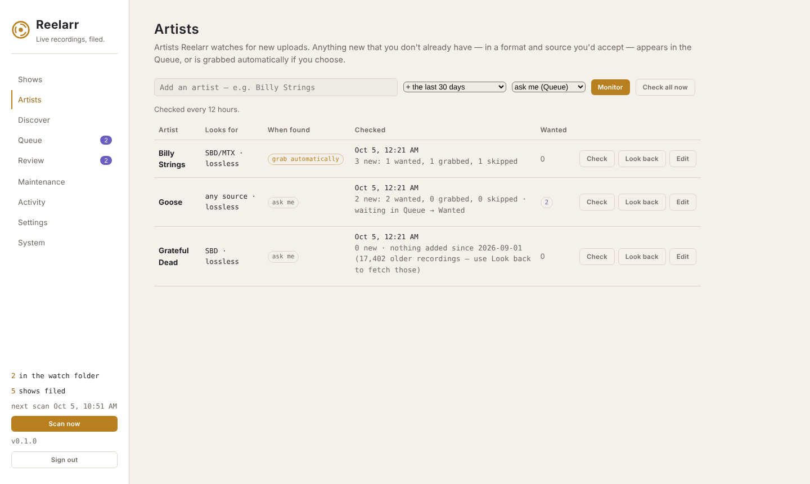
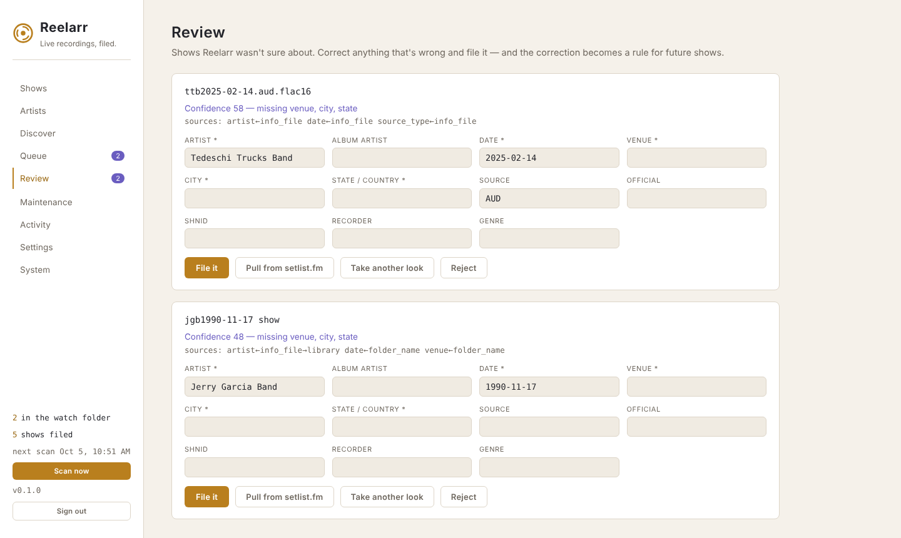

<p align="center"></p>

# Reelarr

[](https://github.com/OWNER/reelarr/actions/workflows/ci.yml)
[](LICENSE)

**An \*arr for live recordings.** Reelarr watches for concert recordings —
soundboards, audience tapes, matrices, Live Music Archive downloads — works
out who played, where, when, what songs and what kind of source it is, tags
everything properly, names it the same way every time, and files it into
your library.

Anything it isn't sure about waits for you in **Review**. Fix it once and
Reelarr learns the correction for every show after it.

- **Identifies the messy stuff.** Etree-style folder names, info files,
  embedded tags, SHNIDs, SBD/AUD/MTX/FOB lineage, setlist.fm and archive.org
  lookups — every value with its provenance.
- **Monitors artists.** Follow an artist and Reelarr checks the Live Music
  Archive for new uploads you don't have, in the sources and formats you'd
  accept — and queues or grabs them.
- **Protects your collection.** Starts in dry run. Never deletes: removed files
  go to a trash folder for 30 days. Every change can be undone. Commercial
  releases are never replaced by fan recordings.
- **Learns.** Corrections you make become standing rules, and your existing
  library teaches it your artists, venues and song titles.

<p align="center">
  
  
  
  
</p>

> Version 0.1.0 — the first public release. See [`CHANGELOG.md`](CHANGELOG.md).
>
> This project is entirely vibecoded with Claude Opus 5.5.

---

## Install

### Docker (recommended)

Download [`docker-compose.yml`](docker-compose.yml) into a folder and run:

```sh
docker compose up -d
```

No `.env` is required. Then open `http://<your-server>:8189` and the setup
wizard takes it from there. The image is multi-arch (amd64 and arm64):
`ghcr.io/OWNER/reelarr:latest`. To build it yourself instead, clone the repo
and run `docker compose up -d --build`.

Docker can only give Reelarr the folders you mount, so mount the folder that
holds your downloads **and** your music. On unRAID, a `.env` next to the
compose file with these lines suits almost everyone:

```
PUID=99
PGID=100
UMASK=000
REELARR_MEDIA_DIR=/mnt/user
REELARR_MEDIA_PATH=/mnt/user
```

> **If the setup wizard's folder browser is empty** — or only shows an
> empty `/media` — Docker hasn't given Reelarr your music yet. That's set in
> Docker, not in the app: create the `.env` above (or set the paths below),
> run `docker compose up -d`, and check again. The wizard shows the same
> instructions, for unRAID, compose, `docker run` and NAS boxes.

| Variable | Default | What it does |
|---|---|---|
| `REELARR_PORT` | `8189` | Port on the host |
| `PUID` / `PGID` | `1000` / `1000` | Who owns the files Reelarr writes |
| `UMASK` | `022` | Permissions for new files (`000` = editable by all) |
| `TZ` | `America/New_York` | Time zone for logs |
| `REELARR_CONFIG_DIR` | `./config` | Settings, databases, backups |
| `REELARR_MEDIA_DIR` | `./media` | Host folder with your music and downloads |
| `REELARR_MEDIA_PATH` | `/media` | Where that folder appears inside the container |

**unRAID Community Applications:** `unraid/reelarr.xml` is a ready template.

### Bare metal

Python 3.10+ and ffmpeg:

```sh
pip install -r requirements.txt
python -m app
```

It listens on `127.0.0.1:8189` — this computer only. Set
`REELARR_HOST=0.0.0.0` to reach it from other machines (keep the login on).
Settings live in your user data folder (`~/.config/reelarr`,
`~/Library/Application Support/Reelarr`, or `%APPDATA%\Reelarr`); override
with `REELARR_CONFIG`.

---

## First run

The setup wizard walks you through:

1. **A login** — or deliberately no login, if your own SSO sits in front.
2. **Folders** — a browser of exactly what Reelarr can reach. It checks the
   watch folder and library exist, are writable, and aren't the same or
   nested.
3. **Download client** (optional) — Deluge, qBittorrent or Transmission. It
   tests the connection, checks it can open the client's downloads, and if
   the two see the folder under different names, proposes and verifies the
   path mapping.
4. **setlist.fm** (optional, free key) — venues and real song titles.
5. **Start-up** — dry run or live, conversion quality, time zone.

Nothing is watched or moved until you press **Finish**, and every choice is
in Settings afterwards.

---

## Using it

| Page | What it's for |
|---|---|
| **Shows** | Everything Reelarr has handled. In dry run, each show has a plan you can open. |
| **Artists** | Artists to monitor for new uploads, with per-artist sources, formats and upgrades. |
| **Discover** | Search the Live Music Archive (or paste an archive.org link) and grab shows. |
| **Queue** | Wanted releases waiting on you; what's downloading, sortable by client order, progress, speed, ETA and more; what's coming in. |
| **Review** | Shows Reelarr wasn't sure about. Correct and file them. |
| **Maintenance** | Learn from your manual fixes, find problems, re-check the library against setlist.fm. |
| **Activity** | Every change on disk — with Undo — and every event. |
| **Settings** | Everything configurable, including security and the API key. |
| **System** | Health checks, version, backups. |

### The loop

1. Shows arrive in the watch folder — from your download client, from
   Discover, from a monitored artist, or because you put them there.
2. Reelarr scans every few minutes (or press **Scan now**).
3. Most shows file themselves. The rest wait in **Review**.
4. Correct anything that's off and press **File it**. Reelarr remembers.

### Monitoring artists

Live recordings don't behave like TV episodes — there's no list of what
"should" exist, and tapes surface years later. So for a monitored artist,
*wanted* means: **a new upload you don't already have** (or a better source
of a date you do, if you turn on upgrades), **in a source and format you'd
accept**. Each upload is judged once, and the Queue shows why it was or
wasn't picked (Queue → Passed over). When you add an artist you choose how far
back to look — new uploads only, 30 days, a year, or everything — and
whether to ask you or grab automatically; it's checked straight away.

For anything to reach your download client you need a **.torrent folder**
and a **download client** (Settings → Torrents), the artist set to **grab
automatically**, and Reelarr **live** (dry run holds automatic grabs in the
Queue). The Artists page tells you which of these is missing.

Uploads that archive.org marks stream-only — many Grateful Dead soundboards,
by the band's request — are recognised and skipped rather than grabbed.

### Early and late shows

Two sets on one night, arriving as two folders, are filed as **one show**.
When two folders have the same artist and date, and one says *early* and the
other *late* — in the folder name, or as "early show" / "late show" in the
info file — Reelarr puts both folders, untouched, inside one show folder:

```
Bob Weir/bw1978-03-25 The Old Waldorf, San Francisco, CA [SBD 082964 TinyDancer & AUD Miller]/
    bwb1978-03-25.sbd.tinydancer.82964.sbeok.flac/        disc 1 (early)
    Bob Weir Band 1978-03-25 San Francisco,CA.late…/       disc 2 (late)
```

Every track gets the same album, with both sources in the bracket, early
first; the early show is disc 1 and the late show disc 2, each numbered from 1.
A folder you drop in that already holds an early and a late subfolder is
handled the same way. Only a clear pair is combined — if one folder doesn't
say which show it is, or there are two lates, they're filed separately.

### Places

Tags read `Venue, City, ST`. In the US and Canada that's the two-letter state
or province; everywhere else it's the country in full — `Paradiso, Amsterdam,
Netherlands`. A built-in list of the world's cities (from
[GeoNames](https://www.geonames.org), CC BY 4.0) turns `NL`, `Holland` or
`Deutschland` into the country, tells `Berlin, DE` (Germany) from `Dover, DE`
(Delaware), and fills a missing state when the city is unambiguous. Prefer
"England" to "United Kingdom"? Settings → Country spellings.

### Safety

- **Dry run** (default on a new install): every change is planned, none made,
  until you press **Go live**.
- **Trash, not delete**: removed files go to `.reelarr-trash/` on the same
  drive and are purged after 30 days (Settings → Safety).
- **Undo**: Activity → Recent changes puts files back and restores their tags.
- **Backups**: System → Make a backup; one is also made before every upgrade.
  To restore, stop Reelarr, unzip a backup into the config folder, start it.

---

## Add-ons

Reelarr can load optional **providers** — packages that bring shows into the
watch folder from somewhere else — and additional **indexers** to search.
See [`docs/providers.md`](docs/providers.md). With none installed there's
nothing extra in the UI.

---

## Common questions

**Will it mess up my existing library?**
It starts in dry run, it never deletes, and every change can be undone.
Rejected and replaced shows are set aside in `_rejected`, `_duplicates` and
`_replaced`; everything else removed goes to `.reelarr-trash` for 30 days.

**A show went to Review and I don't know why.**
The card says what it was unsure of — usually a missing venue or a setlist it
couldn't check. Fix it and press File it.

**Does it work with private trackers?**
Reelarr hands `.torrent` files to your download client and brings finished
downloads back in — so anything you download yourself works. Drop the
`.torrent` in Reelarr's torrent folder, or set your client's category to
Reelarr's label. Reelarr itself only searches the Live Music Archive; it
doesn't log in to or scrape other sites.

**Can it tell an official release from a fan recording?**
Yes: "Official" in a `[bracket]` always counts, and Settings → Filing policy →
*official labels* takes the names of the stores or labels you buy from.
Official releases are never replaced by fan recordings.

**Shows outside the US — what goes where the state would?**
The country, spelled out: `Paradiso, Amsterdam, Netherlands`. Prefer
"England" to "United Kingdom"? Settings → Country spellings.

**The files have the wrong owner.**
Set `PUID`/`PGID` to your system's user and group (unRAID: 99/100; a typical
Linux user: 1000/1000) and recreate the container.

**How do I update?**
`docker compose pull && docker compose up -d` (or `--build` if you build from
source). Upgrades migrate your databases and back them up first.

**How do I stop it?**
`docker compose down`. Everything is saved in `config/`.

---

## What this is for

Reelarr is for organising a personal archive of live recordings you have
the right to collect — the tapers' tradition of freely traded, non-commercial
soundboard and audience recordings. Respect each taper's wishes and each
band's taping policy. Reelarr keeps official releases marked as official and
never replaces them with fan recordings.

---

## Development

```sh
pip install -r requirements.txt pytest httpx ruff
python -m pytest tests -q     # needs ffmpeg
ruff check .
```

See [`CONTRIBUTING.md`](CONTRIBUTING.md). Security problems: please report them
privately — see [`SECURITY.md`](SECURITY.md).

## Licence

Reelarr is free software, licensed under the **GNU General Public License
v3.0** — see [`LICENSE`](LICENSE). You may use, study, change and share it;
if you distribute a modified version, you must share its source under the
same licence.
